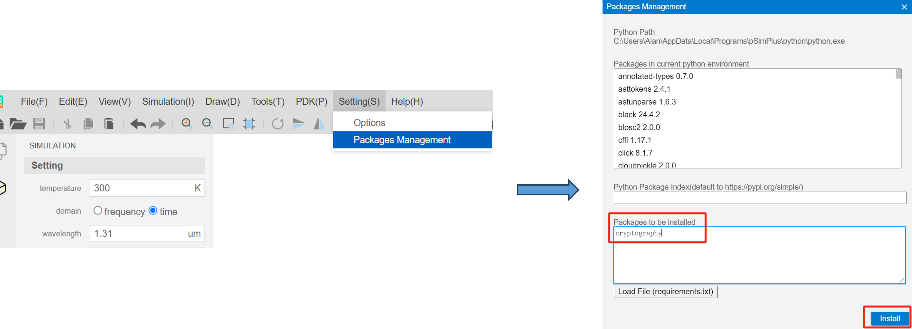
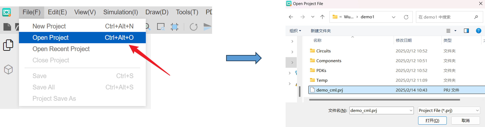
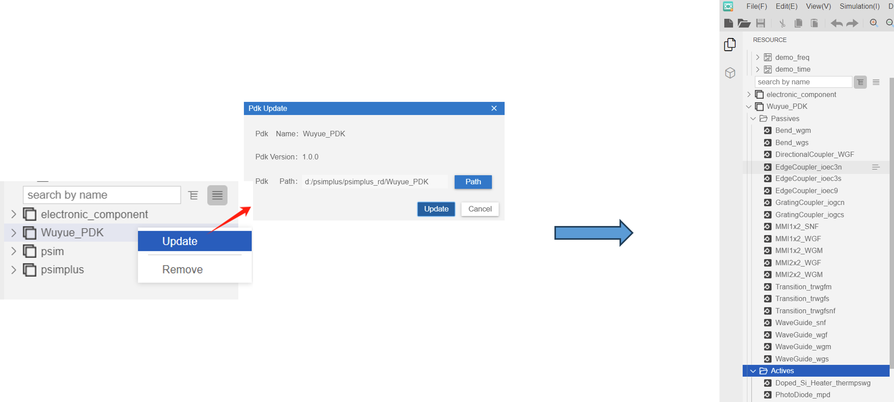
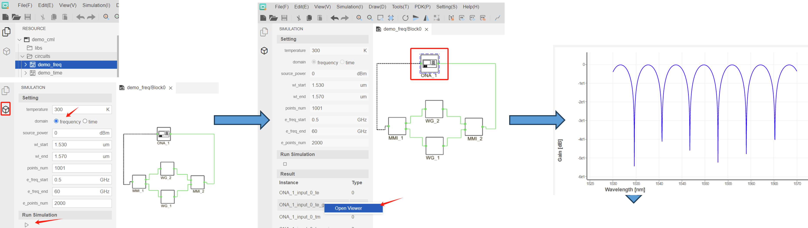
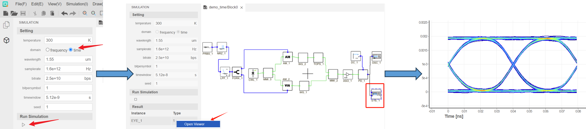
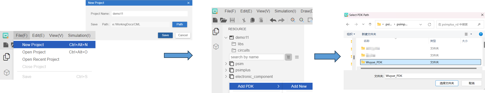

Quick Start Circuit Simulation
=======================================

There is a compact model in WUYUE SP90 PDK, so users can perform circuit simulation to verify that the simulated results are appropriate in **pSim Plus**. The following are the steps to import and use WUYUE sp90 PDK in **pSim Plus**.

Open Project in WUYUE PDK
*******************************************

Before importing WUYUE PDK into **pSim Plus**, users must first install a package into **pSim Plus**.

- Open Packages Management in the Setting options bar.

- Enter ``cryptography`` in the ``Packages to be installed``, click Install, and “All packages installed successfully” will be displayed.

After installing the ``cryptography`` package, click ``File`` > ``Open Project`` and pen ``demo_cml`` > ``demo_cml.prj`` in PDK package.

Update the existing model library: ``Wuyue_PDK`` > ``Update`` > ``Path``, select the folder named "Wuyue_PDK" to import. Note that the ``Path`` is where the PDK is stored on the current computer.

Next, users can use ``circuits`` in ``demo_cml`` to try the time-domain simulation and frequency-domain simulation.

Frequency Domain Simulation
*******************************************

The following is operating steps and its simulation results.

- Open the ``demo_freq`` circuit and switch the left interface from resource to simulation.

- Select ``frequency domin`` and run the simulation by clicking ``Run Simulation``.

- Check ``ONA_1`` and right-click ``te_gain`` in ``Result`` to see the spectrum.

- Stop simulation.

Time Domain Simulation
*******************************************

The following is operating steps and its simulation results.

- Open the ``demo_time`` circuit.

- Select ``time domin`` and run the simulation by clicking ``Run Simulation``.

- Check ``EYE_1`` and click ``Open Viewer`` in ``Result`` to see the result.

- Stop simulation.

Import PDK in New Project
*******************************************

New projects can import PDK as shown below.

- ``File`` > ``New project``

- In the empty space below the ``psimplus`` library, right-click ``Add PDK`` > ``Add New``

- Select the folder named ``Wuyue_PDK`` to import

For more information, please refer to the following website:

| `Bilibili Space`_

| `FAQ`_

.. _Bilibili Space: https://space.bilibili.com/1594183569

.. _FAQ: https://www.xyda.cc/#/