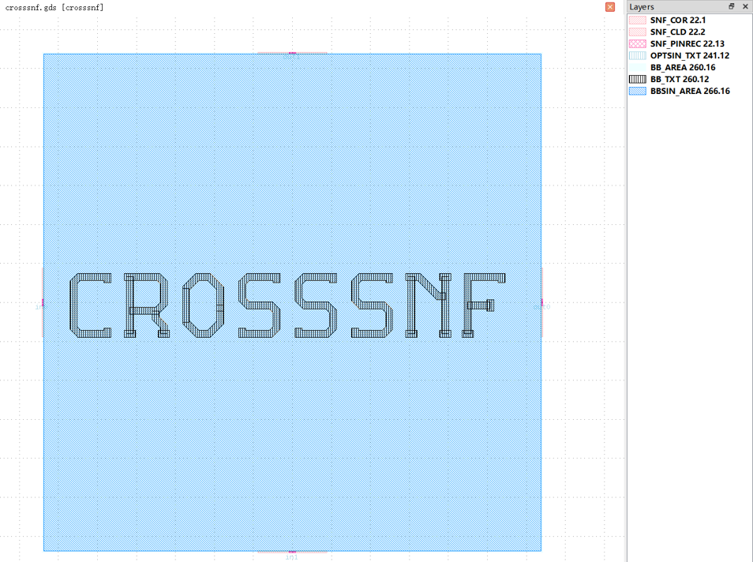
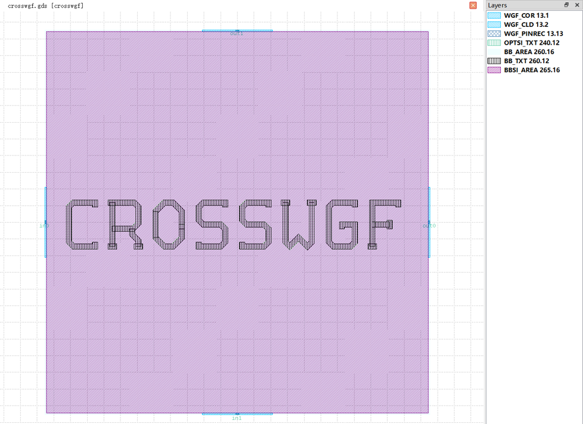

Crossing
#############################

crosssnf
**********************************************************

+-------------------+-----------------------------+------------------------+-------------+
|     ports         | waveguide type              | position               | orientation |
+===================+=============================+========================+=============+
| in0               | TECH.WG.SNF.O.WIRE          | (-32.094, 0.0)         | 180         |
+-------------------+-----------------------------+------------------------+-------------+
| in1               | TECH.WG.SNF.O.WIRE          | (0.0, -32.094)         | -90         |
+-------------------+-----------------------------+------------------------+-------------+
| out0              | TECH.WG.SNF.O.WIRE          | (32.094, 0.0)          | 0           |
+-------------------+-----------------------------+------------------------+-------------+
| out1              | TECH.WG.SNF.O.WIRE          | (0.0, 32.094)          | 90          |
+-------------------+-----------------------------+------------------------+-------------+

crosswgf
**********************************************************

+-------------------+-----------------------------+------------------------+-------------+
|     ports         | waveguide type              | position               | orientation |
+===================+=============================+========================+=============+
| in0               | TECH.WG.WGF.O.WIRE          | (-23.073, 0.0)         | 180         |
+-------------------+-----------------------------+------------------------+-------------+
| in1               | TECH.WG.WGF.O.WIRE          | (0.0, -23.073)         | -90         |
+-------------------+-----------------------------+------------------------+-------------+
| out0              | TECH.WG.WGF.O.WIRE          | (23.073, 0.0)          | 0           |
+-------------------+-----------------------------+------------------------+-------------+
| out1              | TECH.WG.WGF.O.WIRE          | (0.0, 23.073)          | 90           |
+-------------------+-----------------------------+------------------------+-------------+