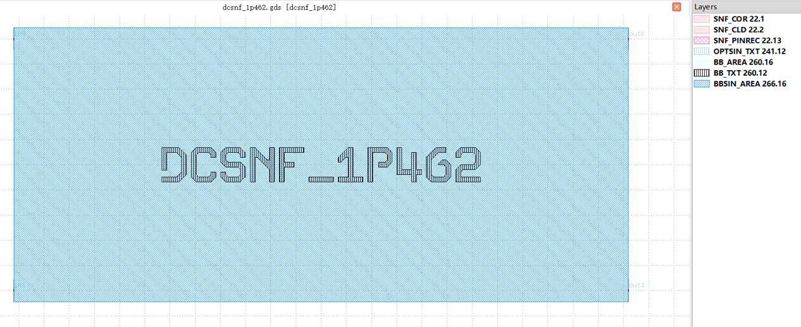

Directional Coupler (DC)
#############################

dcsnf
**********************************************************

+-------------------+-----------------------------+--------------------------------------------------------------------------------+
|     Parameters    | Range                       | Description                                                                    |
+===================+=============================+================================================================================+
| coupling_length   | [1, 200]                    | Length of coupler [um]                                                         |
+-------------------+-----------------------------+--------------------------------------------------------------------------------+
| pin_width         | \                           | Core layer width of the waveguide depends on the waveguide_type parameter [um] |
+-------------------+-----------------------------+--------------------------------------------------------------------------------+
| clad_width        | \                           | Clad layer width of the waveguide depends on the waveguide_type parameter [um] |
+-------------------+-----------------------------+--------------------------------------------------------------------------------+

+-------------------+-----------------------------+-------------+
|     ports         | waveguide type              | orientation |
+===================+=============================+=============+
| in0               | TECH.WG.SNF.O.WIRE          | 180         |
+-------------------+-----------------------------+-------------+
| in1               | TECH.WG.SNF.O.WIRE          | 180         |
+-------------------+-----------------------------+-------------+
| out0              | TECH.WG.SNF.O.WIRE          | 0           |
+-------------------+-----------------------------+-------------+
| out1              | TECH.WG.SNF.O.WIRE          | 0           |
+-------------------+-----------------------------+-------------+

dcwgf
**********************************************************
.. image:: ../images/bb_dcwgf.png

+-------------------+-----------------------------+--------------------------------------------------------------------------------+
|     Parameters    | Range                       | Description                                                                    |
+===================+=============================+================================================================================+
| coupling_length   | [1, 200]                    | Length of coupler [um]                                                         |
+-------------------+-----------------------------+--------------------------------------------------------------------------------+
| pin_width         | \                           | Core layer width of the waveguide depends on the waveguide_type parameter [um] |
+-------------------+-----------------------------+--------------------------------------------------------------------------------+
| clad_width        | \                           | Clad layer width of the waveguide depends on the waveguide_type parameter [um] |
+-------------------+-----------------------------+--------------------------------------------------------------------------------+

+-------------------+-----------------------------+-------------+
|     ports         | waveguide type              | orientation |
+===================+=============================+=============+
| in0               | TECH.WG.WGF.O.WIRE          | 180         |
+-------------------+-----------------------------+-------------+
| in1               | TECH.WG.WGF.O.WIRE          | 180         |
+-------------------+-----------------------------+-------------+
| out0              | TECH.WG.WGF.O.WIRE          | 0           |
+-------------------+-----------------------------+-------------+
| out1              | TECH.WG.WGF.O.WIRE          | 0           |
+-------------------+-----------------------------+-------------+

dcwgm
**********************************************************
.. image:: ../images/bb_dcwgm.png

+-------------------+-----------------------------+--------------------------------------------------------------------------------+
|     Parameters    | Range                       | Description                                                                    |
+===================+=============================+================================================================================+
| coupling_length   | [1, 200]                    | Length of coupler [um]                                                         |
+-------------------+-----------------------------+--------------------------------------------------------------------------------+
| pin_width         | \                           | Core layer width of the waveguide depends on the waveguide_type parameter [um] |
+-------------------+-----------------------------+--------------------------------------------------------------------------------+
| clad_width        | \                           | Clad layer width of the waveguide depends on the waveguide_type parameter [um] |
+-------------------+-----------------------------+--------------------------------------------------------------------------------+

+-------------------+-----------------------------+-------------+
|     ports         | waveguide type              | orientation |
+===================+=============================+=============+
| in0               | TECH.WG.WGM.O.WIRE          | 180         |
+-------------------+-----------------------------+-------------+
| in1               | TECH.WG.WGM.O.WIRE          | 180         |
+-------------------+-----------------------------+-------------+
| out0              | TECH.WG.WGM.O.WIRE          | 0           |
+-------------------+-----------------------------+-------------+
| out1              | TECH.WG.WGM.O.WIRE          | 0           |
+-------------------+-----------------------------+-------------+
