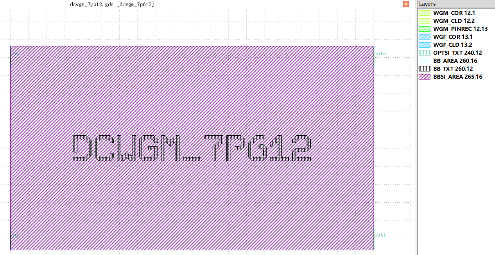

Directional Coupler (DC)
#############################

dcsnf
**********************************************************
.. image:: ../images/bb_dcsnf.png

+-------------------+-----------------------------+------------------------+-------------+
|     ports         | waveguide type              | position               | orientation |
+===================+=============================+========================+=============+
| in0               | TECH.WG.SNF.O.WIRE          | (-122.0629999, 50.001) | 180         |
+-------------------+-----------------------------+------------------------+-------------+
| in1               | TECH.WG.SNF.O.WIRE          | (-122.0629999, -50.001)| 180         |
+-------------------+-----------------------------+------------------------+-------------+
| out0              | TECH.WG.SNF.O.WIRE          | (122.0629999, 50.001)  | 0           |
+-------------------+-----------------------------+------------------------+-------------+
| out1              | TECH.WG.SNF.O.WIRE          | (122.0629999, -50.001) | 0           |
+-------------------+-----------------------------+------------------------+-------------+

dcwgf
**********************************************************
.. image:: ../images/bb_dcwgf.png

+-------------------+-----------------------------+------------------------+-------------+
|     ports         | waveguide type              | position               | orientation |
+===================+=============================+========================+=============+
| in0               | TECH.WG.WGF.O.WIRE          | (-74.4, 35.0)          | 180         |
+-------------------+-----------------------------+------------------------+-------------+
| in1               | TECH.WG.WGF.O.WIRE          | (-74.4, -35.0)         | 180         |
+-------------------+-----------------------------+------------------------+-------------+
| out0              | TECH.WG.WGF.O.WIRE          | (74.4, 35.0)           | 0           |
+-------------------+-----------------------------+------------------------+-------------+
| out1              | TECH.WG.WGF.O.WIRE          | (74.4, -35.0)          | 0           |
+-------------------+-----------------------------+------------------------+-------------+

dcwgf
**********************************************************

+-------------------+-----------------------------+------------------------+-------------+
|     ports         | waveguide type              | position               | orientation |
+===================+=============================+========================+=============+
| in0               | TECH.WG.WGM.O.WIRE          | (-100.22, 50.001)      | 180         |
+-------------------+-----------------------------+------------------------+-------------+
| in1               | TECH.WG.WGM.O.WIRE          | (-100.22, -50.001)     | 180         |
+-------------------+-----------------------------+------------------------+-------------+
| out0              | TECH.WG.WGM.O.WIRE          | (100.22, 50.001)       | 0           |
+-------------------+-----------------------------+------------------------+-------------+
| out1              | TECH.WG.WGM.O.WIRE          | (100.22, -50.001)      | 0           |
+-------------------+-----------------------------+------------------------+-------------+
