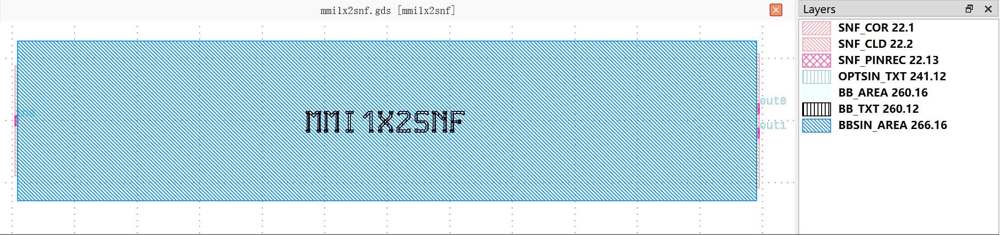
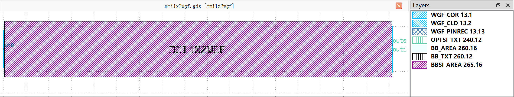
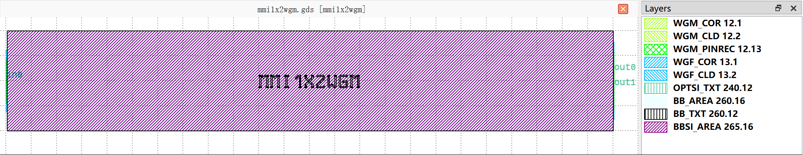
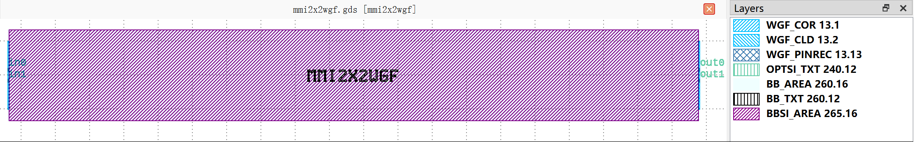
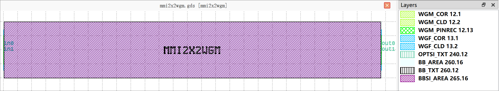

MultiMode Interferometers (MMI)
##########################################################

mmi1x2snf
**********************************************************

+-------------------+-----------------------------+------------------------+-------------+
|     ports         | waveguide type              | position               | orientation |
+===================+=============================+========================+=============+
| in0               | TECH.WG.SNF.O.WIRE          | (-24.8, 0)             | 180         |
+-------------------+-----------------------------+------------------------+-------------+
| out0              | TECH.WG.SNF.O.WIRE          | (34.7, 0.99)           | 0           |
+-------------------+-----------------------------+------------------------+-------------+
| out1              | TECH.WG.SNF.O.WIRE          | (34.7, -0.99)          | 0           |
+-------------------+-----------------------------+------------------------+-------------+

mmi1x2wgf
**********************************************************

+-------------------+-----------------------------+------------------------+-------------+
|     ports         | waveguide type              | position               | orientation |
+===================+=============================+========================+=============+
| in0               | TECH.WG.WGF.O.WIRE          | (-35, 0)               | 180         |
+-------------------+-----------------------------+------------------------+-------------+
| out0              | TECH.WG.WGF.O.WIRE          | (50.8, 0.95)           | 0           |
+-------------------+-----------------------------+------------------------+-------------+
| out1              | TECH.WG.WGF.O.WIRE          | (50.8, -0.95)          | 0           |
+-------------------+-----------------------------+------------------------+-------------+

mmi1x2wgm
**********************************************************

+-------------------+-----------------------------+------------------------+-------------+
|     ports         | waveguide type              | position               | orientation |
+===================+=============================+========================+=============+
| in0               | TECH.WG.WGM.O.WIRE          | (-40, 0)               | 180         |
+-------------------+-----------------------------+------------------------+-------------+
| out0              | TECH.WG.WGM.O.WIRE          | (80.2, 1.525)          | 0           |
+-------------------+-----------------------------+------------------------+-------------+
| out1              | TECH.WG.WGM.O.WIRE          | (80.2, -1.525)         | 0           |
+-------------------+-----------------------------+------------------------+-------------+

mmi2x2wgf
**********************************************************

+-------------------+-----------------------------+------------------------+-------------+
|     ports         | waveguide type              | position               | orientation |
+===================+=============================+========================+=============+
| in0               | TECH.WG.WGF.O.WIRE          | (-32, 0.82)            | 180         |
+-------------------+-----------------------------+------------------------+-------------+
| in1               | TECH.WG.WGF.O.WIRE          | (-32, -0.82)           | 180         |
+-------------------+-----------------------------+------------------------+-------------+
| out0              | TECH.WG.WGF.O.WIRE          | (69, 0.82)             | 0           |
+-------------------+-----------------------------+------------------------+-------------+
| out1              | TECH.WG.WGF.O.WIRE          | (69, -0.82)            | 0           |
+-------------------+-----------------------------+------------------------+-------------+

mmi2x2wgm
**********************************************************

+-------------------+-----------------------------+------------------------+-------------+
|     ports         | waveguide type              | position               | orientation |
+===================+=============================+========================+=============+
| in0               | TECH.WG.WGM.O.WIRE          | (-40, 1.015)           | 180         |
+-------------------+-----------------------------+------------------------+-------------+
| in1               | TECH.WG.WGM.O.WIRE          | (-40, -1.015)          | 180         |
+-------------------+-----------------------------+------------------------+-------------+
| out0              | TECH.WG.WGM.O.WIRE          | (93.5, 1.015)          | 0           |
+-------------------+-----------------------------+------------------------+-------------+
| out1              | TECH.WG.WGM.O.WIRE          | (93.5, -1.015)         | 0           |
+-------------------+-----------------------------+------------------------+-------------+
