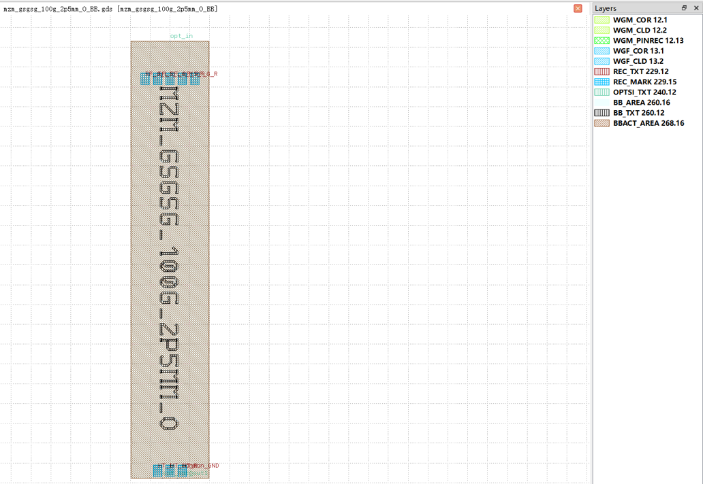

Mach-Zehnder Modulator (MZM)
#############################

mzm_gsgsg_100g_2p5mm_O_BB
**********************************************************

+-------------------+-----------------------------+------------------------+-------------+
|     ports         | waveguide type              | position               | orientation |
+===================+=============================+========================+=============+
| opt_in            | TECH.WG.WGM.O.WIRE          | (0.0, 1860.2)          | 90          |
+-------------------+-----------------------------+------------------------+-------------+
| opt_out0          | TECH.WG.WGM.O.WIRE          | (-75, -2555.0)         | -90         |
+-------------------+-----------------------------+------------------------+-------------+
| opt_out1          | TECH.WG.WGM.O.WIRE          | (75, -2555.0)          | 90          |
+-------------------+-----------------------------+------------------------+-------------+

+-------------------+-----------------------------+------------------------+-------------+
|     pins          | metal line type             | position               | orientation |
+-------------------+-----------------------------+------------------------+-------------+
| RF_G_L            | TECH.METAL.TM.W30           | (-250.0, 1480.0)       | 90          |
+-------------------+-----------------------------+------------------------+-------------+
| RF_S_L            | TECH.METAL.TM.W30           | (-125.0, 1480.0)       | 90          |
+-------------------+-----------------------------+------------------------+-------------+
| RF_G_M            | TECH.METAL.TM.W30           | (0.0, 1480.0)          | 90          |
+-------------------+-----------------------------+------------------------+-------------+
| RF_S_R            | TECH.METAL.TM.W30           | (125.0, 1480.0)        | 90          |
+-------------------+-----------------------------+------------------------+-------------+
| RF_G_R            | TECH.METAL.TM.W30           | (250.0, 1480.0)        | 90          |
+-------------------+-----------------------------+------------------------+-------------+
| HT_L              | TECH.METAL.TM.W30           | (-125.0, 2480.0)       | 90          |
+-------------------+-----------------------------+------------------------+-------------+
| HT_Common_GND     | TECH.METAL.TM.W30           | (0.0, 2480.0)          | 90          |
+-------------------+-----------------------------+------------------------+-------------+
| HT_R              | TECH.METAL.TM.W30           | (125.0, -2480.0)       | 90          |
+-------------------+-----------------------------+------------------------+-------------+