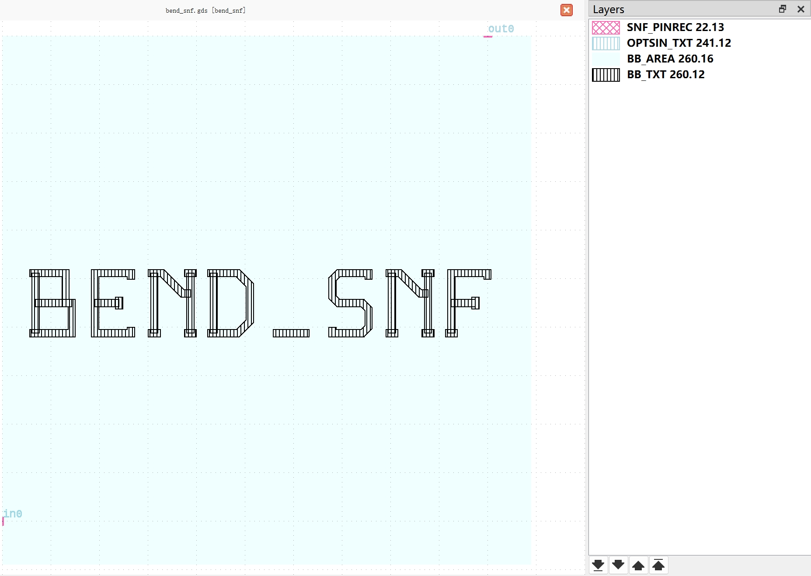
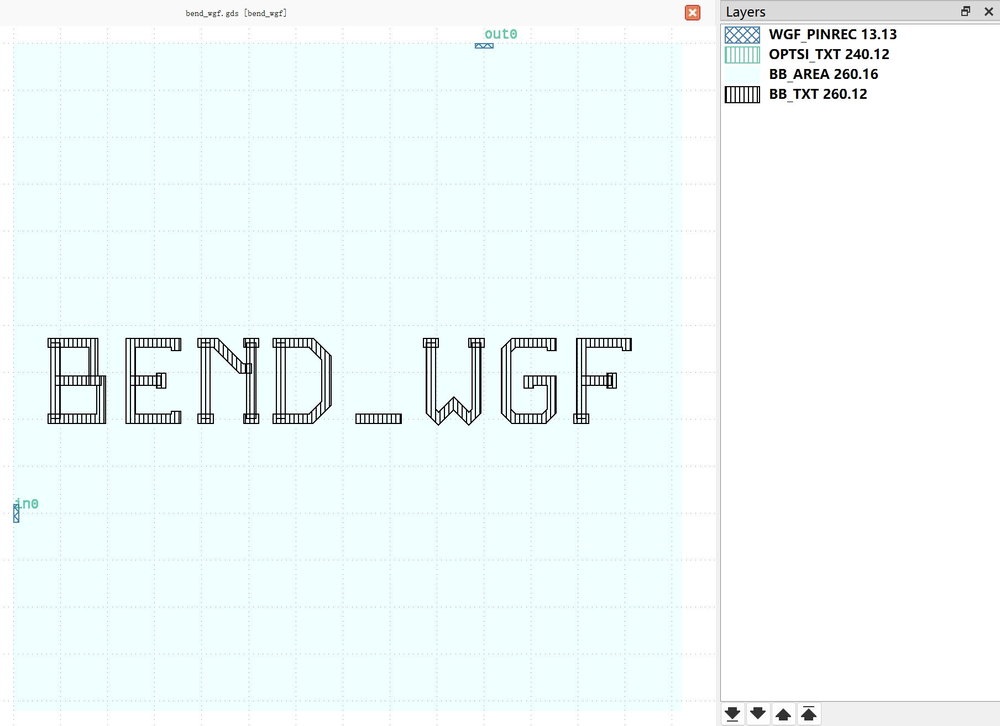
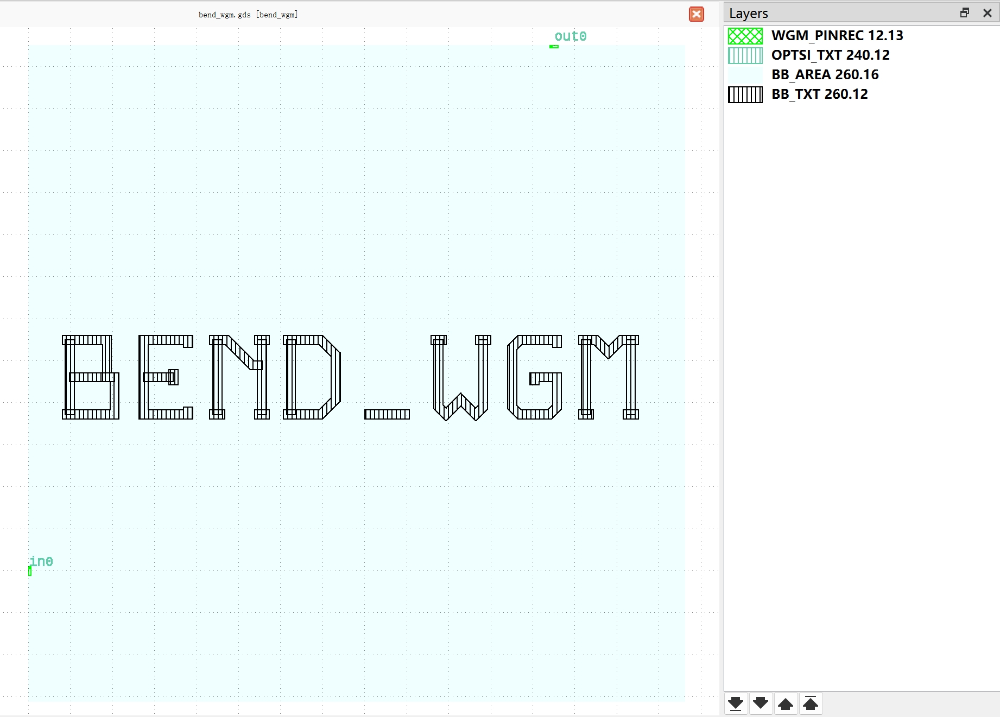
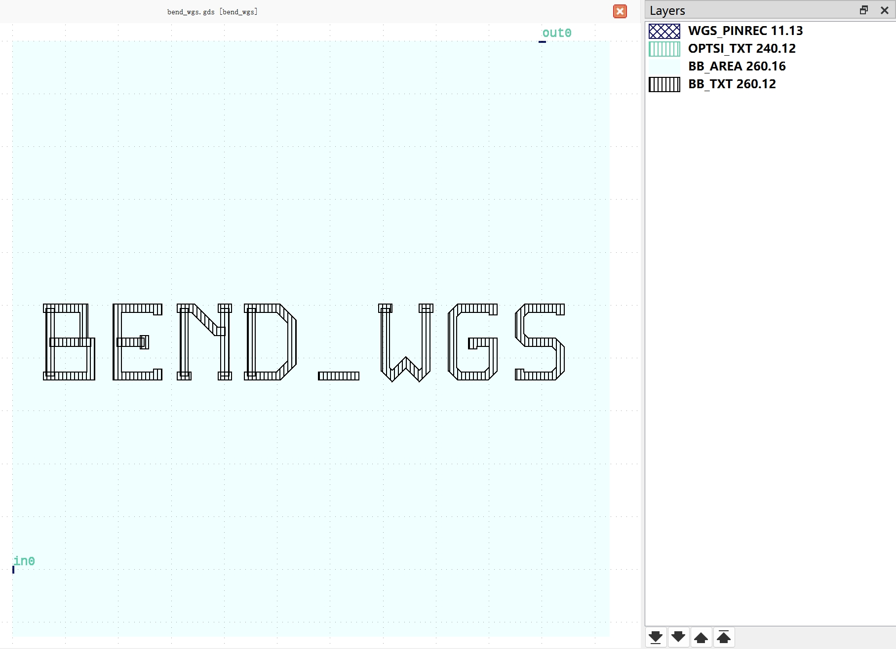

Bend
#############################

bend_snf
**********************************************************

+-------------------+-----------------------------+-------------+-------------+
|     ports         | waveguide type              | position    | orientation |
+===================+=============================+=============+=============+
| in0               | TECH.WG.SNF.O.WIRE          | (0, 0)      | 180         |
+-------------------+-----------------------------+-------------+-------------+
| out0              | TECH.WG.SNF.O.WIRE          | (50, 50)    | 90          |
+-------------------+-----------------------------+-------------+-------------+

bend_wgf
**********************************************************

+-------------------+-----------------------------+-------------+-------------+
|     ports         | waveguide type              | position    | orientation |
+===================+=============================+=============+=============+
| in0               | TECH.WG.WGF.O.WIRE          | (0, 0)      | 180         |
+-------------------+-----------------------------+-------------+-------------+
| out0              | TECH.WG.WGF.O.WIRE          | (10, 10)    | 90          |
+-------------------+-----------------------------+-------------+-------------+

bend_wgm
**********************************************************

+-------------------+-----------------------------+-------------+-------------+
|     ports         | waveguide type              | position    | orientation |
+===================+=============================+=============+=============+
| in0               | TECH.WG.WGM.O.WIRE          | (0, 0)      | 180         |
+-------------------+-----------------------------+-------------+-------------+
| out0              | TECH.WG.WGM.O.WIRE          | (25, 25)    | 90          |
+-------------------+-----------------------------+-------------+-------------+

bend_wgs
**********************************************************

+-------------------+-----------------------------+-------------+-------------+
|     ports         | waveguide type              | position    | orientation |
+===================+=============================+=============+=============+
| in0               | TECH.WG.WGS.O.WIRE          | (0, 0)      | 180         |
+-------------------+-----------------------------+-------------+-------------+
| out0              | TECH.WG.WGS.O.WIRE          | (50, 50)    | 90          |
+-------------------+-----------------------------+-------------+-------------+
