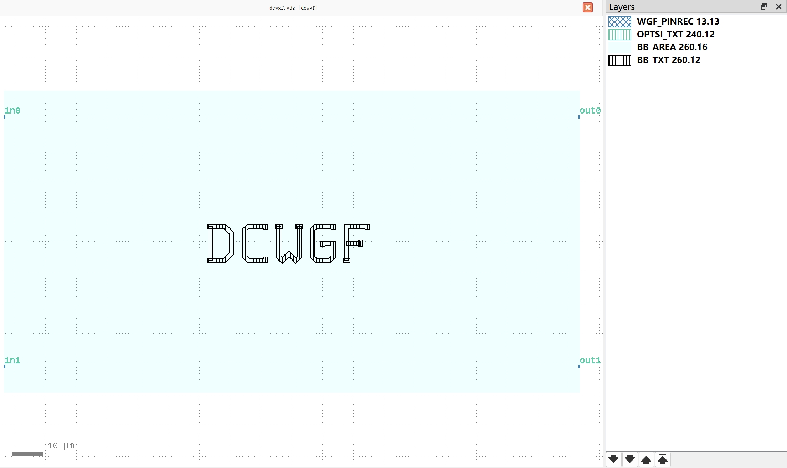

Directional Coupler (DC)
#############################

dcwgf
**********************************************************

+-------------------+-----------------------------+------------------------+-------------+
|     ports         | waveguide type              | position               | orientation |
+===================+=============================+========================+=============+
| in0               | TECH.WG.WGF.O.WIRE          | (-46.719, 20.315)      | 180         |
+-------------------+-----------------------------+------------------------+-------------+
| in1               | TECH.WG.WGF.O.WIRE          | (-46.719, -20.315)     | 180         |
+-------------------+-----------------------------+------------------------+-------------+
| out0              | TECH.WG.WGF.O.WIRE          | (46.719, 20.315)       | 0           |
+-------------------+-----------------------------+------------------------+-------------+
| out1              | TECH.WG.WGF.O.WIRE          | (46.719, -20.315)      | 0           |
+-------------------+-----------------------------+------------------------+-------------+
