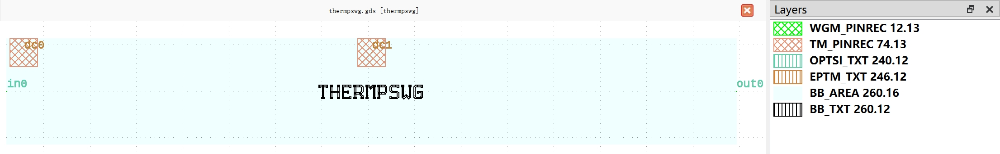

Doped Heater
#############################

thermpswg
**********************************************************

+-------------------+-----------------------------+------------------------+-------------+
|     ports         | waveguide type              | position               | orientation |
+===================+=============================+========================+=============+
| in0               | TECH.WG.WGM.O.WIRE          | (-40, 0)               | 180         |
+-------------------+-----------------------------+------------------------+-------------+
| out0              | TECH.WG.WGM.O.WIRE          | (746.62, 0)            | 0           |
+-------------------+-----------------------------+------------------------+-------------+

+-------------------+-----------------------------+------------------------+-------------+
|     pins          | metal line type             | position               | orientation |
+===================+=============================+========================+=============+
| dc0               | TECH.METAL.TM.W30           | (-21.69, 42)           | 90          |
+-------------------+-----------------------------+------------------------+-------------+
| dc1               | TECH.METAL.TM.W30           | (353.31, 42)           | 90          |
+-------------------+-----------------------------+------------------------+-------------+
