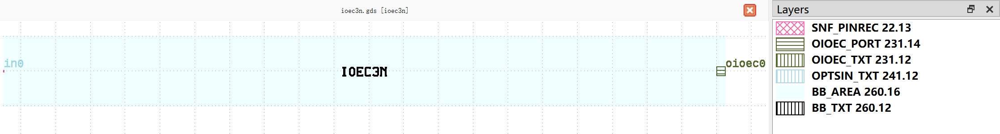
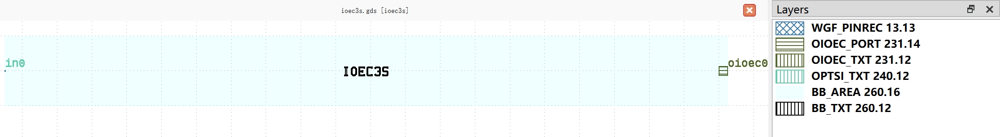
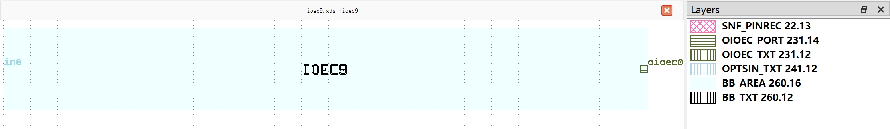

Edge Coupler (EC)
#############################

ioec3n
**********************************************************

+-------------------+-----------------------------+-------------------------------+-------------+
|     ports         | waveguide type              | position                      | orientation |
+===================+=============================+===============================+=============+
| in0               | TECH.WG.SNF.O.WIRE          | (-10, 0)                      | 180         |
+-------------------+-----------------------------+-------------------------------+-------------+

ioec3s
**********************************************************

+-------------------+-----------------------------+-------------------------------+-------------+
|     ports         | waveguide type              | position                      | orientation |
+===================+=============================+===============================+=============+
| in0               | TECH.WG.WGF.O.WIRE          | (-10, 0)                      | 180         |
+-------------------+-----------------------------+-------------------------------+-------------+

ioec9
**********************************************************

+-------------------+-----------------------------+-------------------------------+-------------+
|     ports         | waveguide type              | position                      | orientation |
+===================+=============================+===============================+=============+
| in0               | TECH.WG.SNF.O.WIRE          | (0, 0)                        | 180         |
+-------------------+-----------------------------+-------------------------------+-------------+

