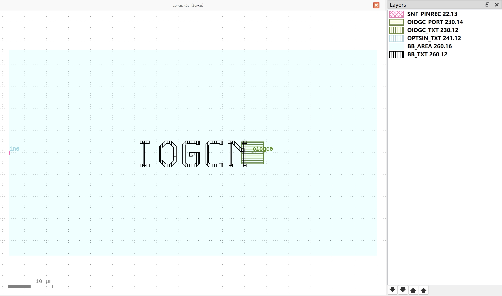
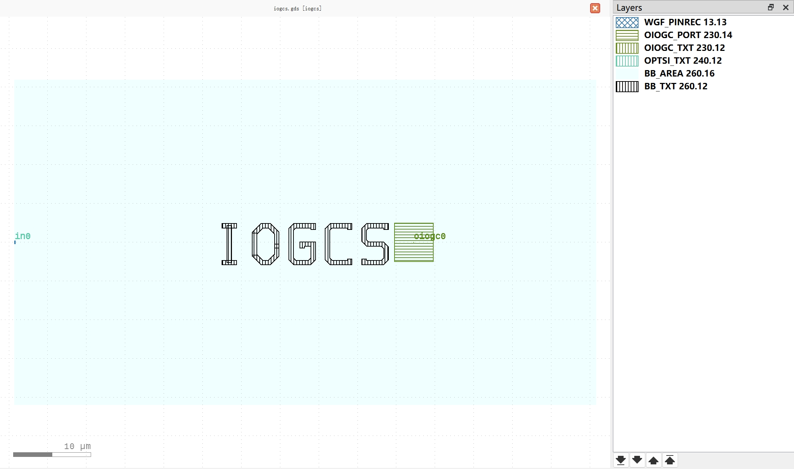

Grating Coupler (GC)
#############################

iogcn
**********************************************************

+-------------------+-----------------------------+-------------------------------+-------------+
|     ports         | waveguide type              | position                      | orientation |
+===================+=============================+===============================+=============+
| in0               | TECH.WG.SNF.O.WIRE          | (-23.50717967697245, 0)       | 180         |
+-------------------+-----------------------------+-------------------------------+-------------+

iogcs
**********************************************************

+-------------------+-----------------------------+-------------------------------+-------------+
|     ports         | waveguide type              | position                      | orientation |
+===================+=============================+===============================+=============+
| in0               | TECH.WG.WGF.O.WIRE          | (-24.290910346561912, 0)      | 180         |
+-------------------+-----------------------------+-------------------------------+-------------+
