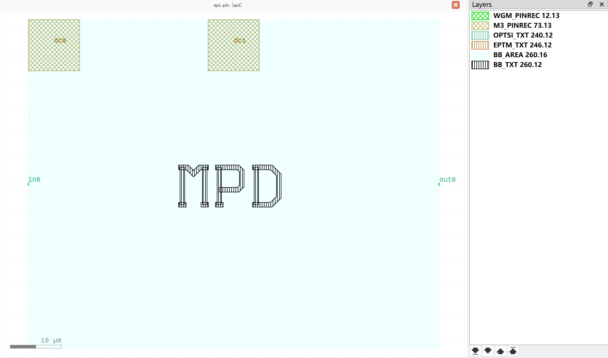

Photo Detectors (PD)
#############################

mpd
**********************************************************

+-------------------+-----------------------------+------------------------+-------------+
|     ports         | waveguide type              | position               | orientation |
+===================+=============================+========================+=============+
| in0               | TECH.WG.WGM.O.WIRE          | (-100.3, 0)            | 180         |
+-------------------+-----------------------------+------------------------+-------------+
| out0              | TECH.WG.WGM.O.WIRE          | (-20, 0)               | 0           |
+-------------------+-----------------------------+------------------------+-------------+

+-------------------+-----------------------------+------------------------+-------------+
|     pins          | metal line type             | position               | orientation |
+===================+=============================+========================+=============+
| dc0               | TECH.METAL.M3.W10           | (-95.23, 27.11)        | 90          |
+-------------------+-----------------------------+------------------------+-------------+
| dc1               | TECH.METAL.M3.W10           | (-60.15, 27.11)        | 90          |
+-------------------+-----------------------------+------------------------+-------------+
