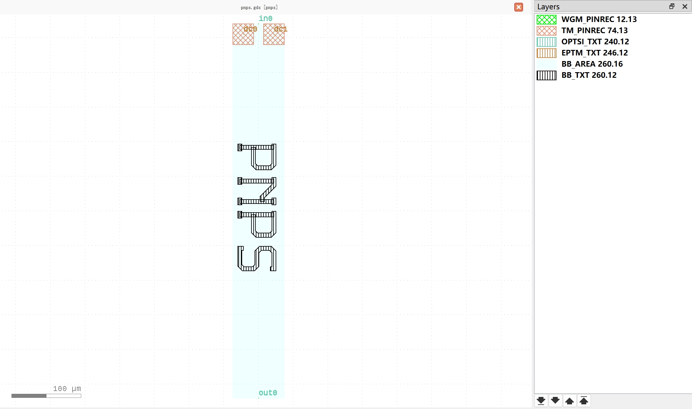

PN Junction Phase Shifter (PNPS)
#############################

pnps
**********************************************************

+-------------------+-----------------------------+------------------------+-------------+
|     ports         | waveguide type              | position               | orientation |
+===================+=============================+========================+=============+
| in0               | TECH.WG.WGM.O.WIRE          | (0, 270)               | 90          |
+-------------------+-----------------------------+------------------------+-------------+
| out0              | TECH.WG.WGM.O.WIRE          | (0, -270)              | -90         |
+-------------------+-----------------------------+------------------------+-------------+

+-------------------+-----------------------------+------------------------+-------------+
|     pins          | metal line type             | position               | orientation |
+===================+=============================+========================+=============+
| dc0               | TECH.METAL.TM.W30           | (-22.1, 255)           | 90          |
+-------------------+-----------------------------+------------------------+-------------+
| dc1               | TECH.METAL.TM.W30           | (22.1, 255)            | 90          |
+-------------------+-----------------------------+------------------------+-------------+
