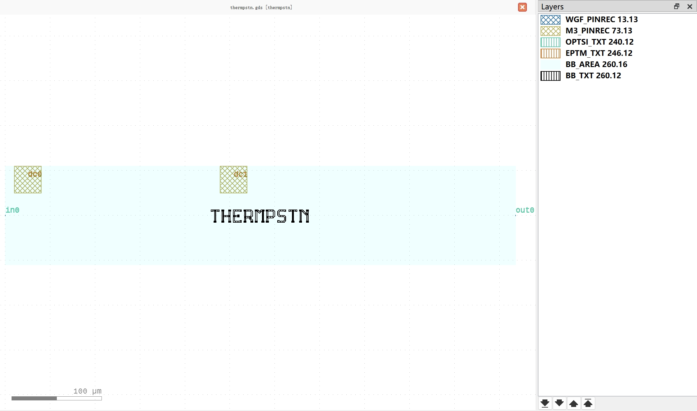

TiN Heater
#############################

thermpstn
**********************************************************

+-------------------+-----------------------------+------------------------+-------------+
|     ports         | waveguide type              | position               | orientation |
+===================+=============================+========================+=============+
| in0               | TECH.WG.WGF.O.WIRE          | (-50, 0)               | 180         |
+-------------------+-----------------------------+------------------------+-------------+
| out0              | TECH.WG.WGF.O.WIRE          | (518, 0)               | 0           |
+-------------------+-----------------------------+------------------------+-------------+

+-------------------+-----------------------------+------------------------+-------------+
|     pins          | metal line type             | position               | orientation |
+===================+=============================+========================+=============+
| dc0               | TECH.METAL.M3.W30           | (-25, 40)              | 90          |
+-------------------+-----------------------------+------------------------+-------------+
| dc1               | TECH.METAL.M3.W30           | (204, 40)              | 90          |
+-------------------+-----------------------------+------------------------+-------------+
