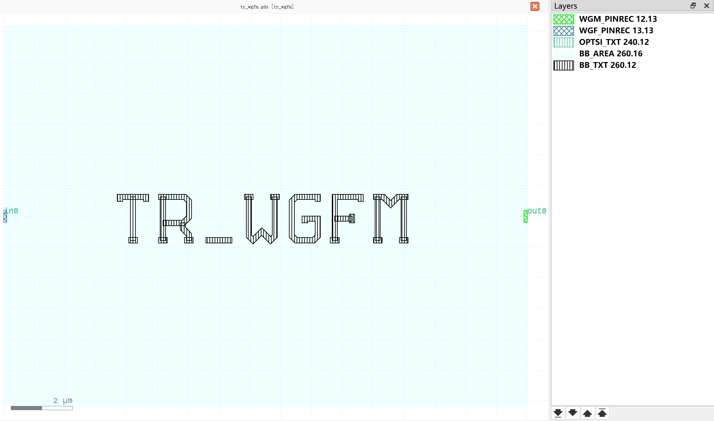
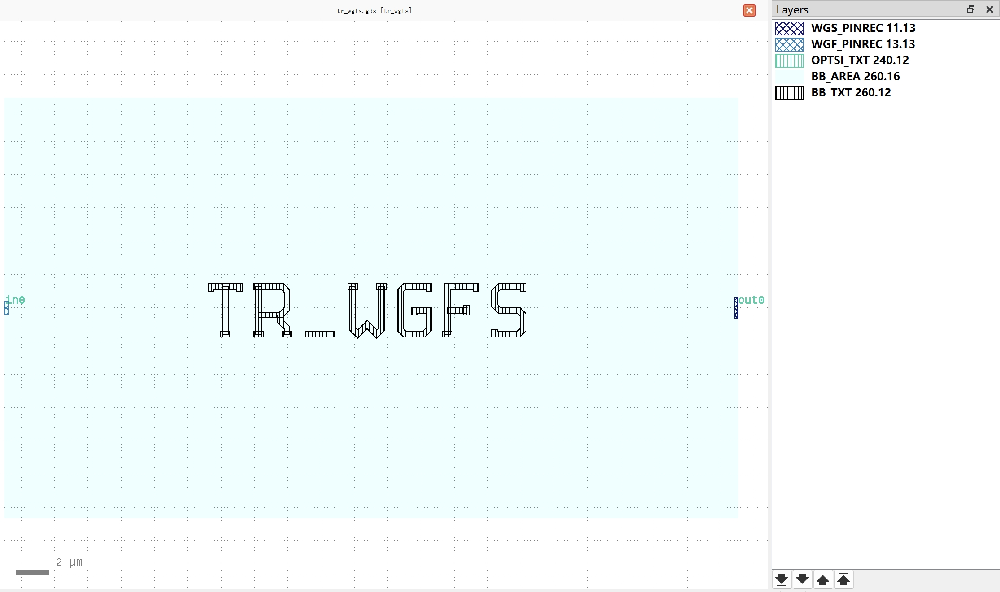
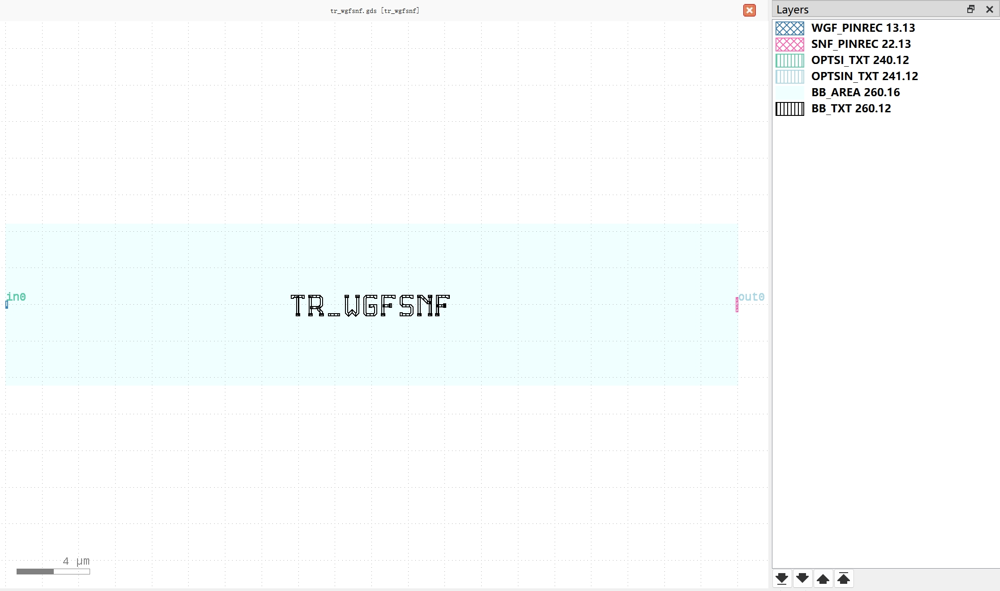

Transition
#############################

tr_wgfm
**********************************************************

+-------------------+-----------------------------+------------------------+-------------+
|     ports         | waveguide type              | position               | orientation |
+===================+=============================+========================+=============+
| in0               | TECH.WG.WGF.O.WIRE          | (-9, 0)                | 180         |
+-------------------+-----------------------------+------------------------+-------------+
| out0              | TECH.WG.WGM.O.WIRE          | (8, 0)                 | 0           |
+-------------------+-----------------------------+------------------------+-------------+

tr_wgfs
**********************************************************

+-------------------+-----------------------------+------------------------+-------------+
|     ports         | waveguide type              | position               | orientation |
+===================+=============================+========================+=============+
| in0               | TECH.WG.WGF.O.WIRE          | (-11.5, 0)             | 180         |
+-------------------+-----------------------------+------------------------+-------------+
| out0              | TECH.WG.WGS.O.WIRE          | (10.5, 0)              | 0           |
+-------------------+-----------------------------+------------------------+-------------+

tr_wgfsnf
**********************************************************

+-------------------+-----------------------------+------------------------+-------------+
|     ports         | waveguide type              | position               | orientation |
+===================+=============================+========================+=============+
| in0               | TECH.WG.WGF.O.WIRE          | (-20, 0)               | 180         |
+-------------------+-----------------------------+------------------------+-------------+
| out0              | TECH.WG.SNF.O.WIRE          | (20, 0)                | 0           |
+-------------------+-----------------------------+------------------------+-------------+
