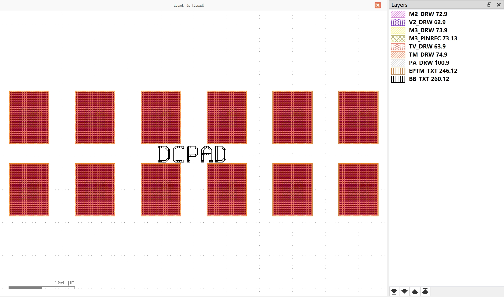

Pad
#############################

dcpad
**********************************************************

+-------------------+-----------------------------+------------------------+-------------+
|     pins          | metal line type             | position               | orientation |
+===================+=============================+========================+=============+
| dc00              | TECH.METAL.M3.W30           | (0, 0)                 | 90          |
+-------------------+-----------------------------+------------------------+-------------+
| dc01              | TECH.METAL.M3.W30           | (100, 0)               | 90          |
+-------------------+-----------------------------+------------------------+-------------+
| dc02              | TECH.METAL.M3.W30           | (200, 0)               | 90          |
+-------------------+-----------------------------+------------------------+-------------+
| dc03              | TECH.METAL.M3.W30           | (300, 0)               | 90          |
+-------------------+-----------------------------+------------------------+-------------+
| dc04              | TECH.METAL.M3.W30           | (400, 0)               | 90          |
+-------------------+-----------------------------+------------------------+-------------+
| dc05              | TECH.METAL.M3.W30           | (500, 0)               | 90          |
+-------------------+-----------------------------+------------------------+-------------+
| dc10              | TECH.METAL.M3.W30           | (0, 110)               | 90          |
+-------------------+-----------------------------+------------------------+-------------+
| dc11              | TECH.METAL.M3.W30           | (100, 110)             | 90          |
+-------------------+-----------------------------+------------------------+-------------+
| dc12              | TECH.METAL.M3.W30           | (200, 110)             | 90          |
+-------------------+-----------------------------+------------------------+-------------+
| dc13              | TECH.METAL.M3.W30           | (300, 110)             | 90          |
+-------------------+-----------------------------+------------------------+-------------+
| dc14              | TECH.METAL.M3.W30           | (400, 110)             | 90          |
+-------------------+-----------------------------+------------------------+-------------+
| dc15              | TECH.METAL.M3.W30           | (500, 110)             | 90          |
+-------------------+-----------------------------+------------------------+-------------+
